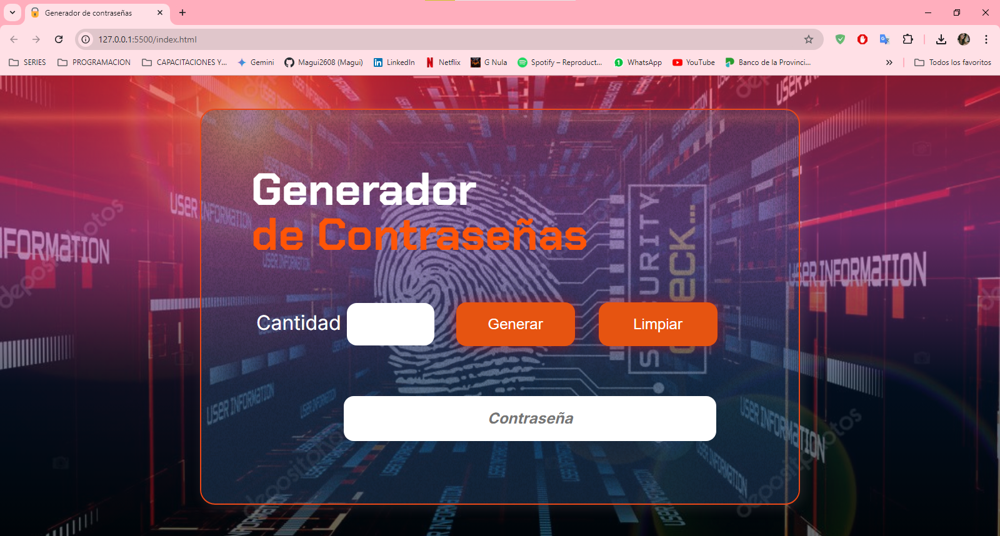

# Inmersion Dev con Javascript - Alura Latam

## Generador de Contraseñas 🔐
Este proyecto te permite generar _**contraseñas seguras**_ de forma *aleatoria*, combinando letras mayúsculas y minúsculas, números y símbolos. La aplicación también incluye una función de validación para evaluar la fortaleza de las contraseñas generadas.

## Funcionalidades 🔩
- Generación aleatoria: Crea contraseñas únicas y robustas.
- Personalización: Define la longitud de la contraseña según tus necesidades.
- Validación de fortaleza: Evalúa la seguridad de la contraseña y muestra un mensaje al usuario.
- Limpieza de campos: Permite reiniciar los campos para generar nuevas contraseñas.

## Cómo utilizar ⚙️
1. Ingresa la longitud: Escribe el número deseado de caracteres para tu contraseña.
2. Genera la contraseña: Haz clic en el botón _**"Generar"**_ para obtener una contraseña aleatoria.
3. Valida la contraseña: La aplicación te informará si la contraseña es *fuerte* o *débil*.
4. Limpiar campos: Haz clic en el botón _**"Limpiar"**_ para reiniciar los campos.

## Mejoras implementadas 🛠️
- Símbolos especiales: Se han agregado *símbolos especiales* a la cadena de caracteres para aumentar la complejidad de las contraseñas.
- Botón de limpiar: Se ha agregado un botón para limpiar los campos de entrada.
- Validación de fortaleza: Se ha implementado una función básica para evaluar la fortaleza de las contraseñas. Puedes mejorar esta función utilizando expresiones regulares más complejas o bibliotecas especializadas.

## Próximos pasos 👣
- Personalización: Permitir al usuario seleccionar los tipos de caracteres a incluir en la contraseña (por ejemplo, solo números y letras).
- Historial de contraseñas: Almacenar las contraseñas generadas para consultarlas posteriormente.
- Exportación de contraseñas: Permitir exportar las contraseñas a un archivo.
- Integración con gestores de contraseñas: Conectar la aplicación con gestores de contraseñas populares.

## Consideraciones de seguridad 🛡️
- Aleatoriedad: Utiliza funciones matemáticas para garantizar la aleatoriedad de las contraseñas.
- Complejidad: Combina diferentes tipos de caracteres para crear contraseñas más seguras.
- Almacenamiento: No almacenes las contraseñas generadas en el lado del cliente.

### Instalación y uso 🔧
1. Clona el repositorio:
	```
    Bash git clone https://github.com/Magui2608/Generador_de_password.git
    ```

2.	Abre el archivo HTML: Abre el archivo `index.html` correspondiente en tu navegador web.

### Tecnologías utilizadas 💻
- JavaScript: Lenguaje de programación principal para generar contraseñas, validarlas y manejar la interacción del usuario.
- HTML: Estructura de la página web. Contiene el marcado HTML de la página, incluyendo los elementos de la interfaz de usuario.
- CSS: Estilos visuales de la página.

### Contribuciones ✨
**¡Las contribuciones son bienvenidas!** Si encuentras algún error o deseas agregar nuevas funcionalidades, por favor, crea un issue o un pull request en el repositorio.




